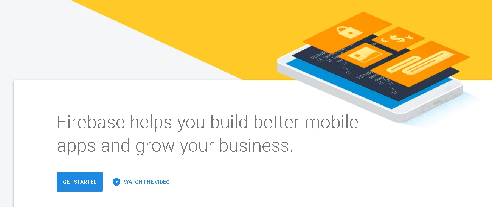
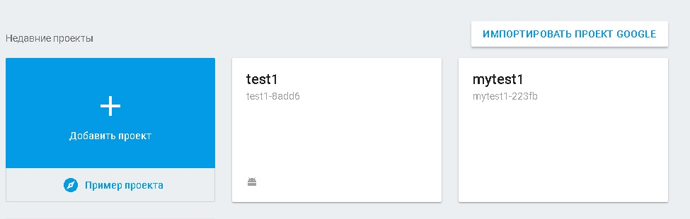
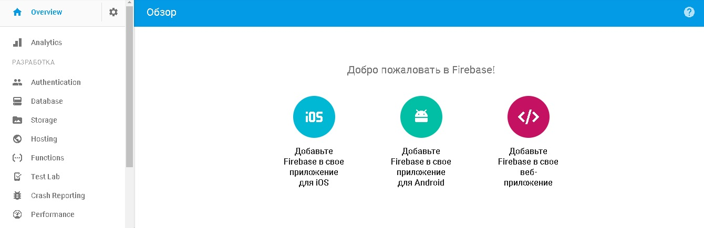

# Facebook to Firebase Tutorial
*Учебное пособие по использованию базы данных реального времени Google Firebase с использованием webhooks от Facebook API*

## Начало

[Google Firebase] (https://firebase.google.com/) предоставляет ряд функций по хранению данных в формате SQL.  

## Firebase

Для начала перейдите на страницу [https://firebase.google.com/] (https://firebase.google.com/) и нажмите на кнопку **Get Started For Free**. Если вы еще не вошли в Google, то необходимо это сделать.

Используйте кнопку **Создать новый проект**, чтобы создать новый проект или **Добавить проект**, чтобы добавить еще один проект. В одном проекте может быть несколько таблиц данных, я буду использовать пример "mytest1."

Когда вы создадите проект, вы увидите основные пункты по разработке, поддержке и доходу вашего проекта. Разберем основное:

* Overview - показывает все то, что вы можете сделать со своим проектом (в одном пункте)
* Analytics - позволяет оценить, насколько эффективно используется приложение
* Authentication - управление пользователями и аутентефикацией (как с помощью Web, так и с помощью скриптов) 
* Database - показывает базу данных (изменять информацию можно вручную на сайте и с помощью скриптов)
* Storage - можно загружать какие-либо файлы на сервер
* Hosting - здесь вы можете увидеть используемый домен и историю развертываний базы данных + текущая версия
* Functions - функци вашего проекта. Один из самых основных пунктов, позволяющий загружать функции на сервер для дальнейшей автоматической подгрузки в базы данных

