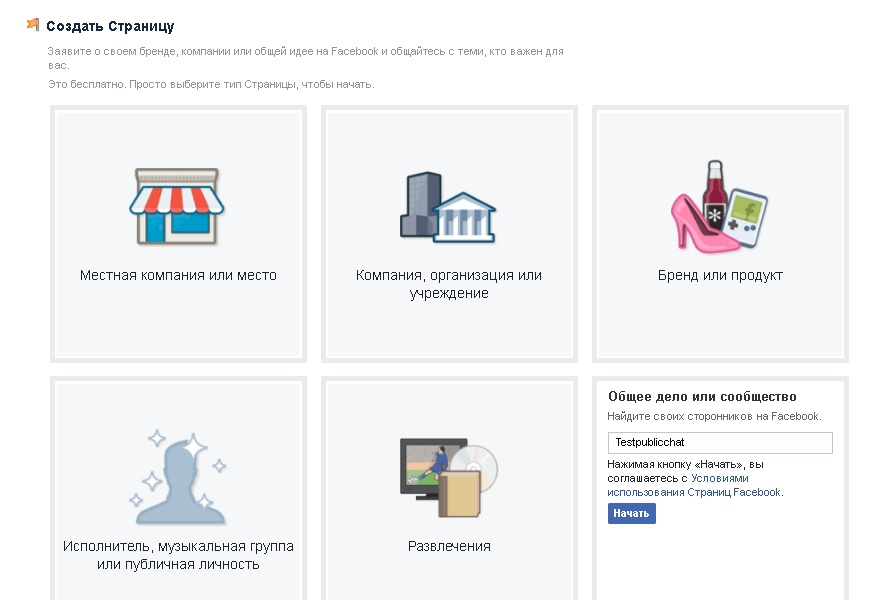
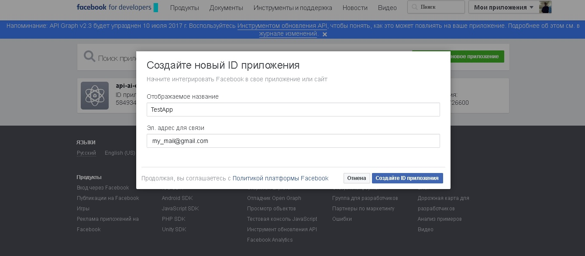
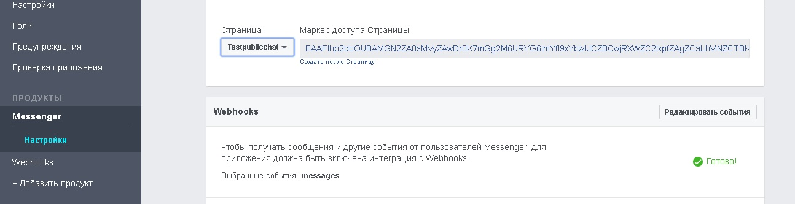
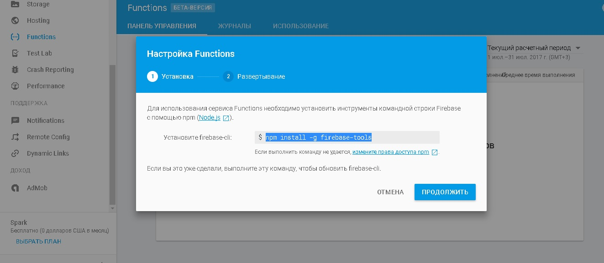
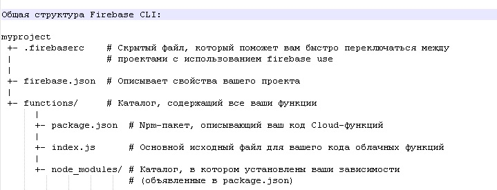
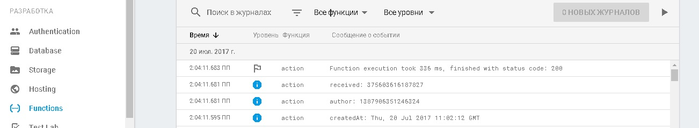

# Facebook to Firebase Tutorial
*Учебное пособие по использованию базы данных реального времени Google Firebase с использованием webhooks от Facebook API*

## Начало

[Facebook for developers] (https://developers.facebook.com/) - платформа, помогающая строить, развивать и монетизировать свой бизнес. В данном примере я буду использовать продукты Messenger и Webhooks.

[Google Firebase] (https://firebase.google.com/) предоставляет ряд функций по хранению данных в формате SQL. В данном примере я буду использовать базу данных для хранения истории переписки с публичной страницей Facebook.

## Facebook

Ваш аккаунт должен быть зарегестрирован на [Facebook] (https://www.facebook.com). После регистрации (если вы этого еще не сделали) необходимо создать публичную страницу. Нажмите на стрелку на верхней панели (правее знака вопроса) и выберите **Создать страницу**.

Затем необходимо выбрать страницу, которую вы будете создавать. При создании некоторых страниц необходимо вводить дополнительные данные (например, категория), самым простым вариантом является **Общее дело или сообщество**, где требуется только название.

## Facebook for developers

Сперва-наперво зарегестрируйтесь на [Facebook for developers] (https://developers.facebook.com/), перейдите на вкладку **Мои приложения** [Facebook apps] (https://developers.facebook.com/apps/) и создайте или добавьте новое приложение.

В левой панели нажмите на кнопку **+Добавить продукт**, выберите Messenger. Теперь необходимо выбрать страницу для генерирования маркера, который будет использоваться для получения доступа к этой странице.

Так же, нужно добавить продукт Webhooks. 
* Callbackurl (URL обратного вызова) отвечает за ту страницу, на которую Facebook будет отправлять данные
* Подтвердить маркер - маркер, который ваша страница должна обратно отослать на Facebook
* Поле подписки - поля подписки, которые Facebook будет отправлять с публичной страницы

Вернемся к этому пункту позже, после настройки базы данных Firebase.
 
## Firebase

Для начала перейдите на страницу [https://firebase.google.com/] (https://firebase.google.com/) и нажмите на кнопку **Get Started For Free**. Если вы еще не вошли в Google, то необходимо это сделать.

Используйте кнопку **Создать новый проект**, чтобы создать новый проект или **Добавить проект**, чтобы добавить еще один проект. В одном проекте может быть несколько таблиц данных, я буду использовать пример "mytest1."

Когда вы создадите проект, вы увидите основные пункты по разработке, поддержке и доходу вашего проекта. Разберем основное:

* Overview - показывает все то, что вы можете сделать со своим проектом (в одном пункте)
* Analytics - позволяет оценить, насколько эффективно используется приложение
* Authentication - управление пользователями и аутентефикацией (как с помощью Web, так и с помощью скриптов) 
* Database - показывает базу данных (изменять информацию можно вручную на сайте и с помощью скриптов)
* Storage - можно загружать какие-либо файлы на сервер
* Hosting - здесь вы можете увидеть используемый домен и историю развертываний базы данных + текущая версия
* Functions - функци вашего проекта. Один из самых основных пунктов, позволяющий загружать функции на сервер для дальнейшей автоматической подгрузки информации в базы данных

## Firebase CLI

*Прим.: Более подробная информация предоставлена на сайте [Docs Firebase] (https://firebase.google.com/docs/cli/).*

Нажав на кнопку **Начать** (пункт Functions), вам будет предложено скачать и установить [Node.js] (https://nodejs.org/en/) для дальнейшей работы с инструментами Firebase (npm).

Для дальнейшей работы рекомендую создать отдельуню папку *Firebase Tools* или *Firebase CLI*, где вы будете производить основные действия. Все команды выполняются с помощью командной строки (в моем случае Windows и вызов cmd).

Находясь в директории *Firebase CLI/*, произведите установку инструментария для Firebase, выполнив команду: 

*npm install -g firebase-tools*

После установки Firebase CLI, залогинтесь в firebase, используя аккаунт от Google:

*firebase login*

Следующий шаг инициализации очень важен, так как с помощью него вы определяете рабочую директорию Firebase CLI. Все действия с вашим проектом вне этой директории могут привести к созданию файлов в нерабочих директориях, которые, естественно, не будут работать должным образом. Чтобы инициализировать новый каталог проекта, запустите:

*firebase init*

Вам будет предложено выбрать базу данных, а так же, при необходимости, настроить другие параметры. 

Для того чтобы развернуть вашу базу данных из командной строки Firebase CLI в Firebase, необходимо выполнить команду:

*firebase deploy*

Допустимо присутствие флага --only в том случае, если вы хотите развернуть только отдельные составляющие вашей базы данных, например: hosting, functions, database, storage. Эти имена соответствуют ключам в файле конфигурации firebase.json. Пример развертывания функции myFunction, описанной в файле index.js:

*firebase deploy --only functions:myFunction*

Посмотреть список всех баз данных Firebase можно с помощью следующей команды:

*firebase list*

Переключиться на другую базу данных можно с помощью:

*firebase use database*

Вместо database необходимо использовать название вашей базы данных, вернее ее id, которое можно посмотреть с помощью предыдущей команды или на сайте.

Общая структура Firebase CLI:

## Writing index.js

Функции, которые мы реализуем в файле index.js будут передаваться на сервер Firebase и храниться там. 

Для начала необходимо подключить библиотеку функций

const functions = require('firebase-functions'); 

После чего напшием функцию, которая будет получать данные (response) и запрашивать данные (request).

exports.action = functions.https.onRequest((req, res) => {	
	get(req, res);
});

Внутри вызывается функцию get (вынесена отдельно):

	function get(req, res) 
	{
	
		//Special Facebook token, read developers.facebook.com/docs/graph-api/webhooks
		if (req.query['hub.verify_token'] === 'abc1337') {
			res.send(req.query['hub.challenge']);
		} else {
			
			//ody of request
			var data = req.body;

			//Make sure this is a page subscription
			if (data.object === 'page') {

				//Iterate over each entry - there may be multiple if batched
				data.entry.forEach(function(entry) {
					var pageID = entry.id;
					var timeOfEvent = entry.time;

						// Iterate over each messaging event
						entry.messaging.forEach(function(event) {
							if (event.message) {
								receivedMessage(event);
							} else {
								console.log("Webhook received unknown event: ", event);
							}
						});
				});
				res.sendStatus(200);
			}	
		} 
	}

Если мы получили запрос от Facebook на токен и этот токен равен abc1337, то отправляем запрос 'hub.challenge'. В ином случае мы получили сообщение, которое необходимо обработать (с помощью функции receivedMessage).

В конце отправляем статус 200, чтобы Facebook не отправлял нам запросы повторно.

Реализуем функцию receivedMessage:

	function receivedMessage(event) 
	{
		var timeOfMessage = event.timestamp;
		var message = event.message;
		var senderID = event.sender.id;
		var recipientID = event.recipient.id;
		
		messageDate = new Date(timeOfMessage);
		console.log("createdAt: ", messageDate.toUTCString());
		console.log("author: %d", senderID);
		console.log("received: %d", recipientID);
	}

Сообщения принимаются с помощью event, записываем в логи то, что приходит от пользователей. Сохраняем файл index.js и разворачиваем нашу базу данных с помощью firebase deploy.

После успешного развертывания появляется наша функция action.

Возвращаемся к создаваемому нами приложению (TestApp), куда мы хотели записать некоторые данные.

* URL обратного вызова - записываем сюда адрес, который был указан на последнем изображении (вместе с action)
* Подтвердить маркер - abc1337 (который был указан в функции get)
* Поле подписки - выделяем messages 

После этого создался Webhook, выберем страницу, с которой он будет отсылаться (Testpublicchat), попробуем что-нибудь написать в этот чат от своего имени. Смотрим в журналы функций и видим:

Пришло наше сообщение.
